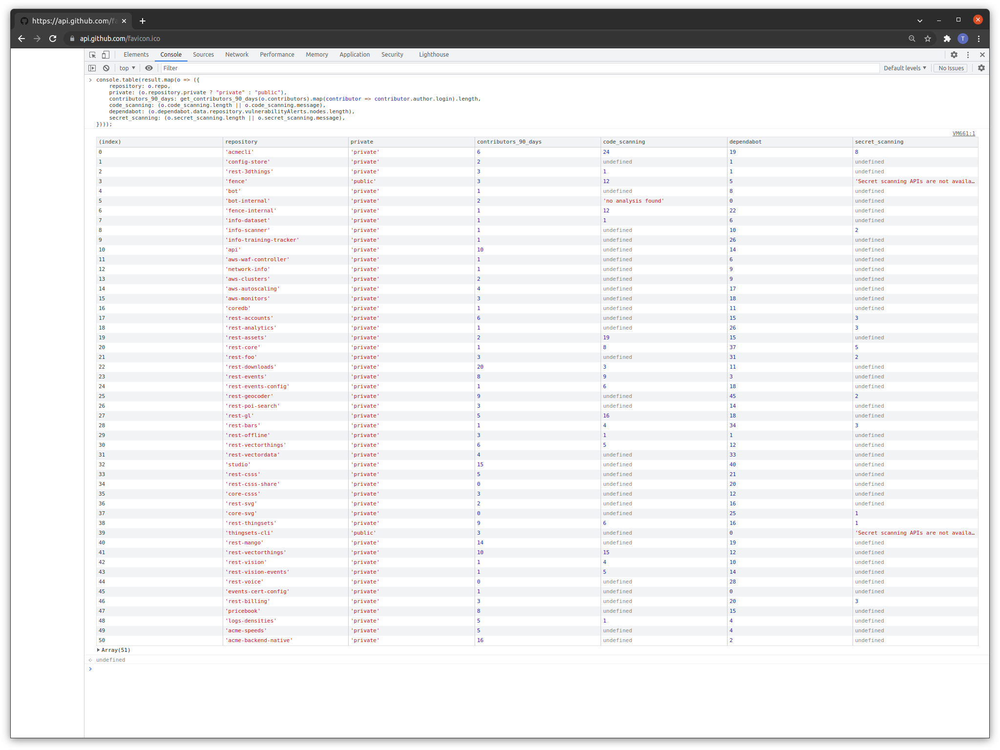
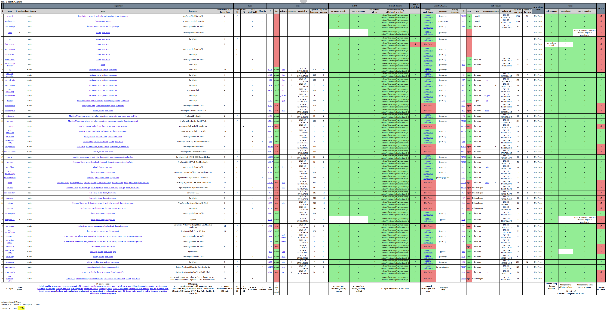

# GitHub Advanced Security (GHAS) dashboard

My custom dashboard to track implementation of GitHub Advanced Security (GHAS) with code scanning (CodeQL), Dependabot, and secret scanning, in my organization with 350 users and 50 repos.

simple:

full:

